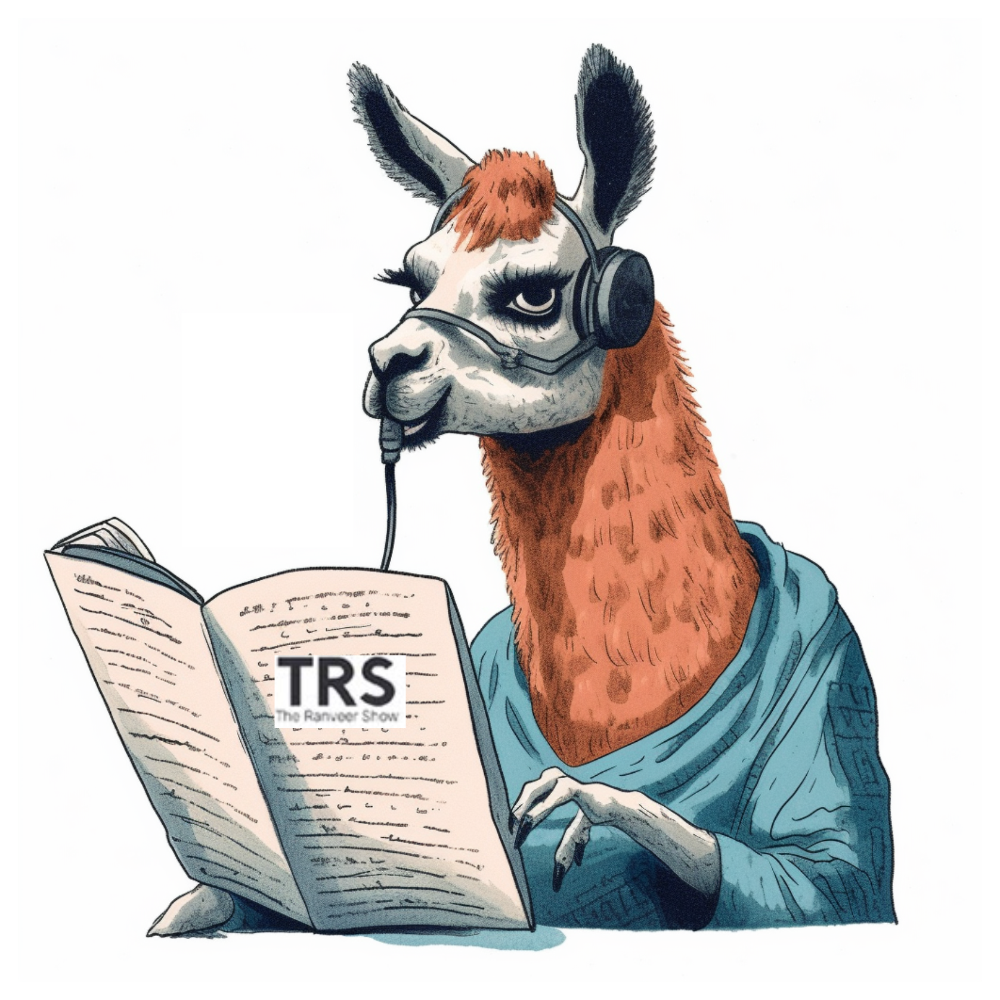

# Ask The Ranveer Show (TRS)
A Gradio WebApp / 
[Huggingface Spaces](https://huggingface.co/spaces/ucalyptus/AskTRS)
to perform [retrieval augmented generation (RAG)](https://arxiv.org/pdf/2005.11401) on The Ranveer Show podcast using Langchain, OpenAI Ada Embeddings and FAISS.

# Usage
Obtain an API key from OpenAI and set it as the value of the api_key variable in the script.

```
pip install -r requirements.txt
export OPENAI_API_KEY=<API_KEY>
python app.py
```

# Known Issues/ ToDo
- Replace with an open-source alternative to OpenAI ada embeddings. See [embeddings](https://python.langchain.com/en/latest/reference/modules/embeddings.html).
- Docker setup for this webapp.
- Trial with [GPU version of FAISS](https://colab.research.google.com/drive/1eMhGmu370Fq2RJcWGcXUzFwaJ0JGrLSR?usp=sharing) (not compatible yet for Python 3.10)
- Should retrieve embeddings from a known cache (such as Pinecone DB) to avoid re-encoding already visited videos.
- Custom LlamaHub loader for Podcasts (not just a single video).



